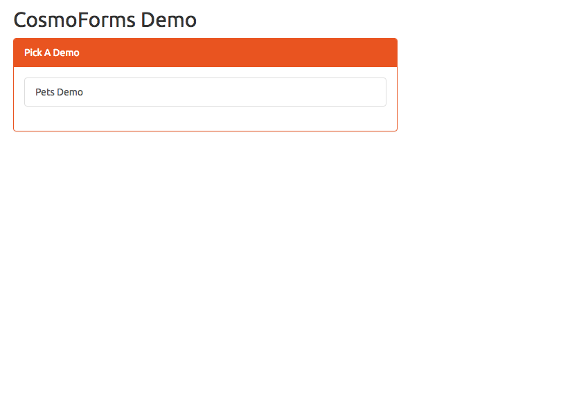

# CosmoForms Demo

This is a fully integrated demo with backend and database support.

### Setup Requirements

You will need the following to fully run this demo. 

1. **Java 8** - this is the version the demo code is written in, however, any Java version will work with CosmoForms since backend technologies are not tied to the framework.
2. **Maven 3.3.X or Above** - Maven is a standard java build tool
2. **Tomcat 8** - or any other Java server that can run Java 8 and Servlet Api version 3.1
3. **MongoDB 3.4.X** - popular document database

Unfortunately, we will not be providing steps on how to set up the above technologies/platforms since that is beyond the scope of this document. 
However, here are some links to help you install and get started with the above:

- [Java 8 Install/Setup](https://docs.oracle.com/javase/8/docs/technotes/guides/install/install_overview.html)
- [Maven 3.3.X Install/Setup](https://maven.apache.org/install.html)
- [Tomcat 8 Install/Setup](https://tomcat.apache.org/tomcat-8.0-doc/setup.html)
- [MongoDB 3.4.X Install/Setup](https://docs.mongodb.com/manual/installation/)

### Running Demo

1. First, make sure you have Java 8 installed and available
2. Make sure you have successfully installed Maven
3. Make sure MongoDB is up and running
4. Execute "mvn clean package"
    - this will create a war file named: "comosforms_demo.war"
    - deploy this file to Tomcat's "webapps" directory
5. Start Tomcat
6. Open your favorite browser and goto:
    - http://localhost:8080/cosmoforms_demo
    
If all is working well, you will the following page:

    
